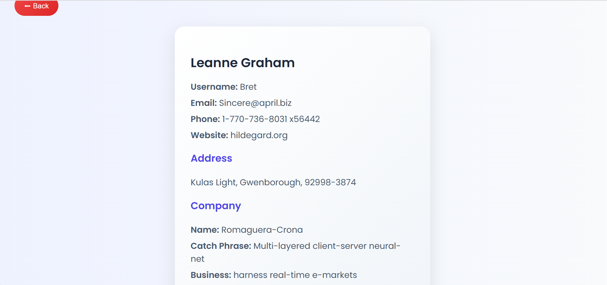
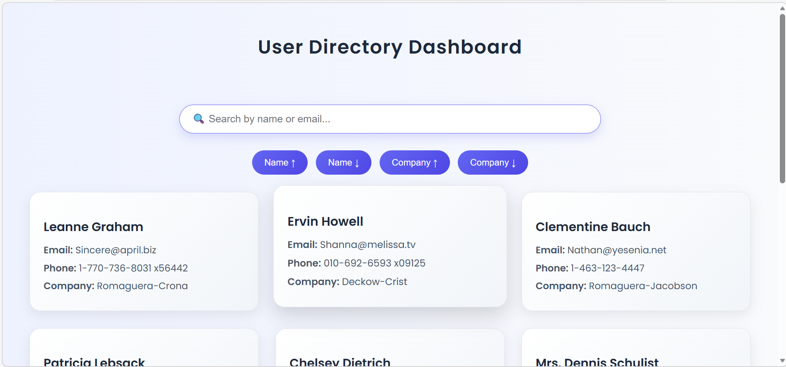

# 🚀 User Directory Dashboard

A modern and responsive **User Directory Dashboard** built using React.  
This application fetches user data from a public API and provides powerful features like search, sorting, and detailed user views.

---

## 📌 Features

### 🔍 Search Users
- Filter users by **name or email** (client-side search)

### 🔄 Sorting
- Sort users dynamically by:
  - **Name** (Ascending / Descending)
  - **Company** (Ascending / Descending)

### 👤 User Detail Page
- View complete information of a selected user:
  - Contact details (Email, Phone, Website)
  - Address information
  - Company details (Name, Catchphrase, Business)

### 🎨 Premium UI
- Clean and modern **card-based layout**
- Smooth **hover effects**
- Responsive and user-friendly design

### 🔙 Navigation
- Seamless routing using **React Router**
- Back button for better user experience

---

## 🛠️ Tech Stack

- **React (Create React App)**
- **JavaScript (ES6+)**
- **CSS (Custom Styling)**
- **React Router DOM**

---

## 🌐 API Used

- https://jsonplaceholder.typicode.com/users

---

## 📂 Project Structure
src/
├── components/
│ ├── UserList.js
│ ├── UserDetail.js
│ ├── SearchBar.js
│ └── UserCard.js
├── styles/
│ ├── App.css
│ ├── UserList.css
│ ├── UserDetail.css
│ └── SearchBar.css
├── App.js
└── index.js


---

## 🚀 Getting Started

### 1. Clone the repository
```bash
git clone https://github.com/your-username/user-directory-dashboard.git


## Navigate to the project
cd user-directory-dashboard

## Install dependencies
npm install

## Start the development server
npm start

📸 Screenshots
### 🏠 Dashboard


### 👤 User Detail Page


## 💡 Future Improvements
🌙 Dark Mode
📄 Pagination / Infinite Scroll
⏳ Loading Skeletons
⚠️ Error Handling UI
📱 Enhanced Mobile Responsiveness

👩‍💻 Author
Hashma Sulthana Shaik


